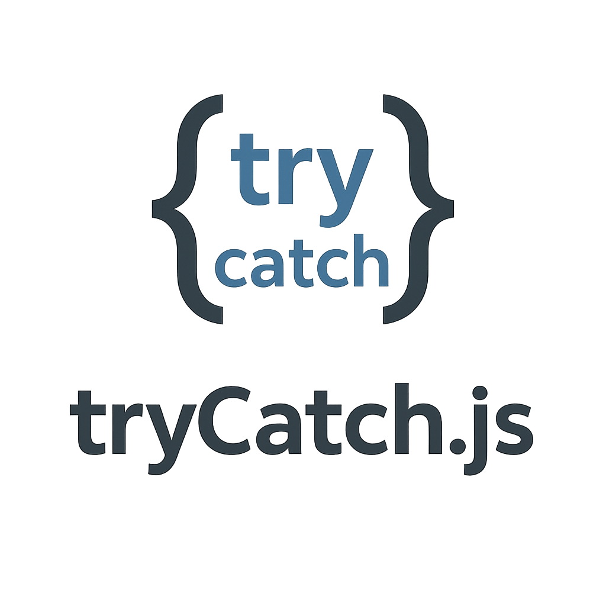

A robust wrapper for asynchronous and synchronous operations.

## Installation

```bash
npm install @spongesoftware/trycatch
```

## Contributing

Contributions are welcome! Please feel free to open an issue or submit a pull request.

## License

This project is licensed under the MIT License - see the [LICENSE](LICENSE) file for details.
